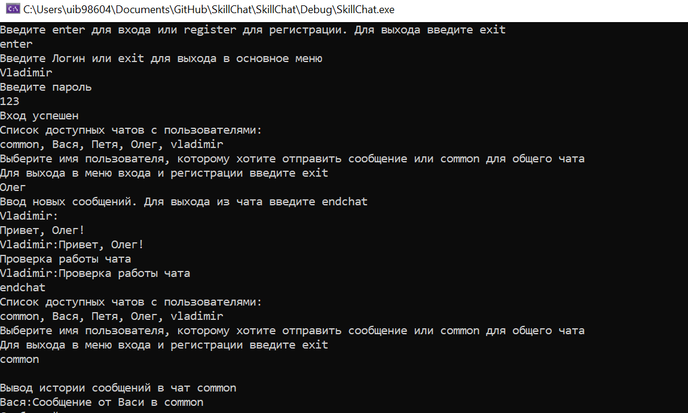

# SkillChat
<h1 align="center">Console Chat</h1>

## Описание

Простая программа чата, позволяющая пользователям регистрироваться, заходить под своим именем и писать сообщения или всем пользователям, или кому-либо конкретному по своему выбору

## Как использовать

### Вход и регистрация

При старте программы пользователю будет предложена возможность войти или зарегистрироваться. Используя предлагаемые программой комманды можно сделать и то и другое

### Использование чата

При успешном входе пользователю будет показан список доступных чатов. Введите название нужного и пишите туда все, что пожелаете
